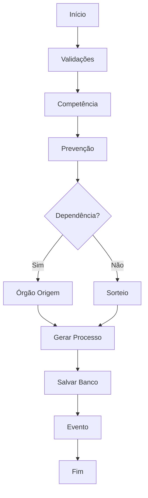
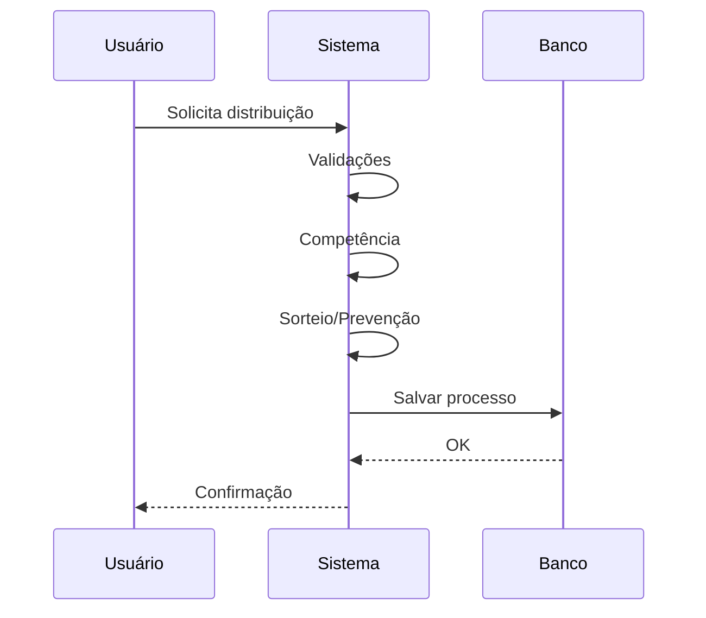

# 📋 Análise do Método distribuir()

Fluxo Completo de Distribuição de Processos - DistribuicaoRN.php

---

## [1] Visão Geral

O método `distribuir()` coordena todo o fluxo de distribuição de processos.

---

## [2] FASE 1: Validações e Preparação

### 2.1 Verificações Iniciais

#### 2.1.1 Bloqueio de Horários
```php
DistribuicaoRN::verificarBloqueioDistribuicaoProcesso();
```

#### 2.1.2 Coleta de Dados Básicos
```php
$numIdClasseJudicial
$arrObjParteProcessoDTO
$bolMigracaoSiapro
$bolDigitalizacaoProcesso2G
```

#### 2.1.3 Buscar Classe
```php
$objClasseJudicialDTO = $this->buscarDadosDaClasse($numIdClasseJudicial);
```

#### 2.1.4 Validações Obrigatórias
- validarCondicoesDaClasse()
- validarDistribuicaoJusPostulandi()
- validarDistribuicao()

---

## [3] FASE 2: Competência

### 3.1 Processamento

#### 3.1.1 Recuperar Juízos
```php
$this->recuperarJuizosLocalidade(...);
```

#### 3.1.2 Buscar Competências
```php
$this->buscarCompetenciasPorClasseLocalidade(...);
```

#### 3.1.3 Filtrar por Assunto
```php
$this->buscarCompetenciasComAssunto(...);
```

#### 3.1.4 Selecionar Competência Final

---

## [4] FASE 3: Prevenção

#### 4.1.1 Verificar Prevenção
```php
$this->verificarPrevencao(...);
```

---

## [5] Fluxo Geral (Mermaid)



---

## [6] Seleção e Sorteio

#### 6.1.1 Buscar Juízos
```php
$this->buscarJuizosComMenorQuantidade(...);
```

#### 6.1.2 Sortear
```php
$this->sortear(...);
```

---

## [7] Geração do Processo

#### 7.1.1 Gerar Número
```php
$this->gerarNumeroProcesso(...);
```

---

## [8] Persistência

#### 8.1.1 Salvar Processo
```php
$this->salvarProcesso(...);
```

#### 8.1.2 Lançar Evento
```php
$this->lancarEvento(...);
```

---

## [9] Pós-processamento

#### 9.1.1 Documentos
#### 9.1.2 Partes
#### 9.1.3 Localizadores

---

## [10] Exceções

- rollback
- log
- retorno erro

---

## [11] Fluxo Simplificado


